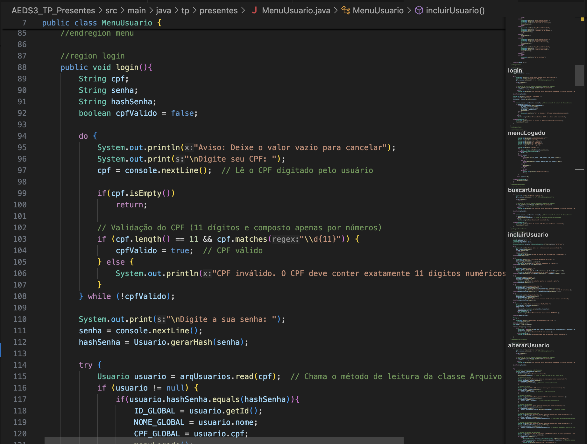
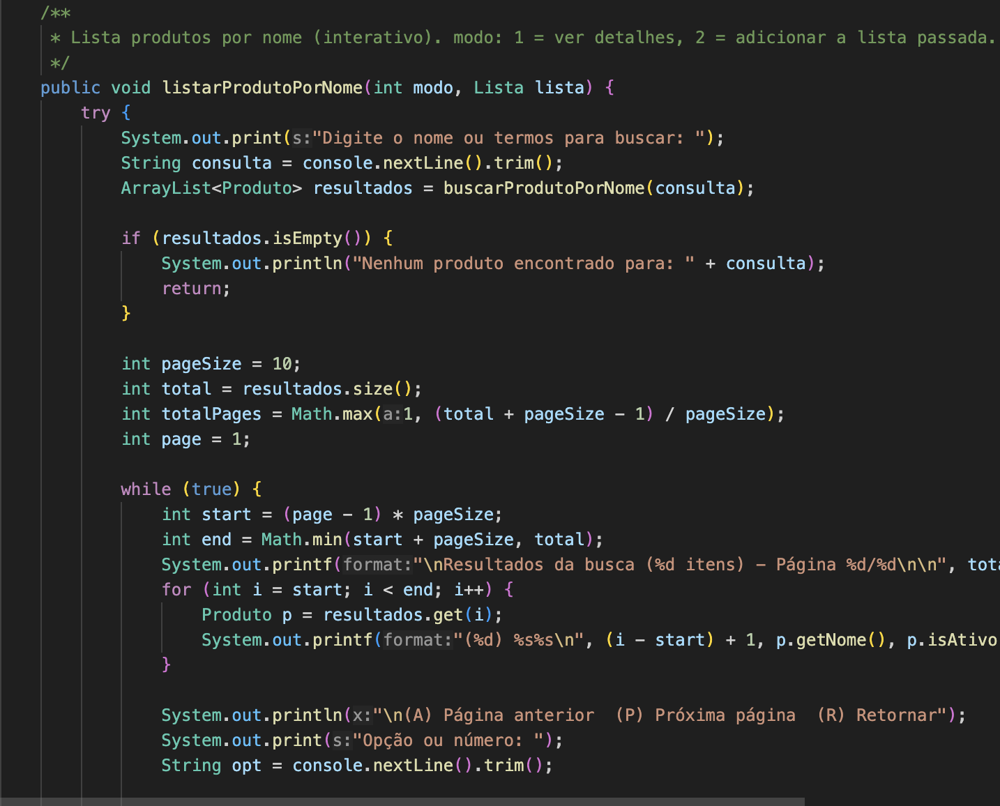
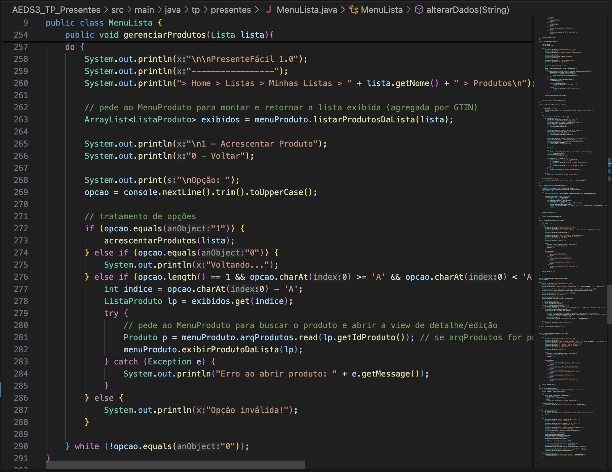
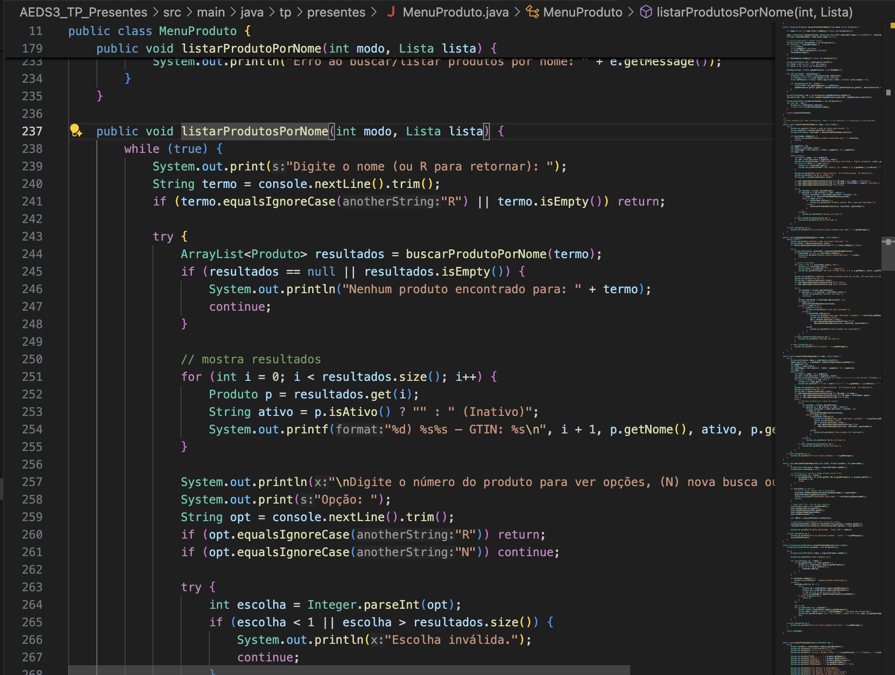
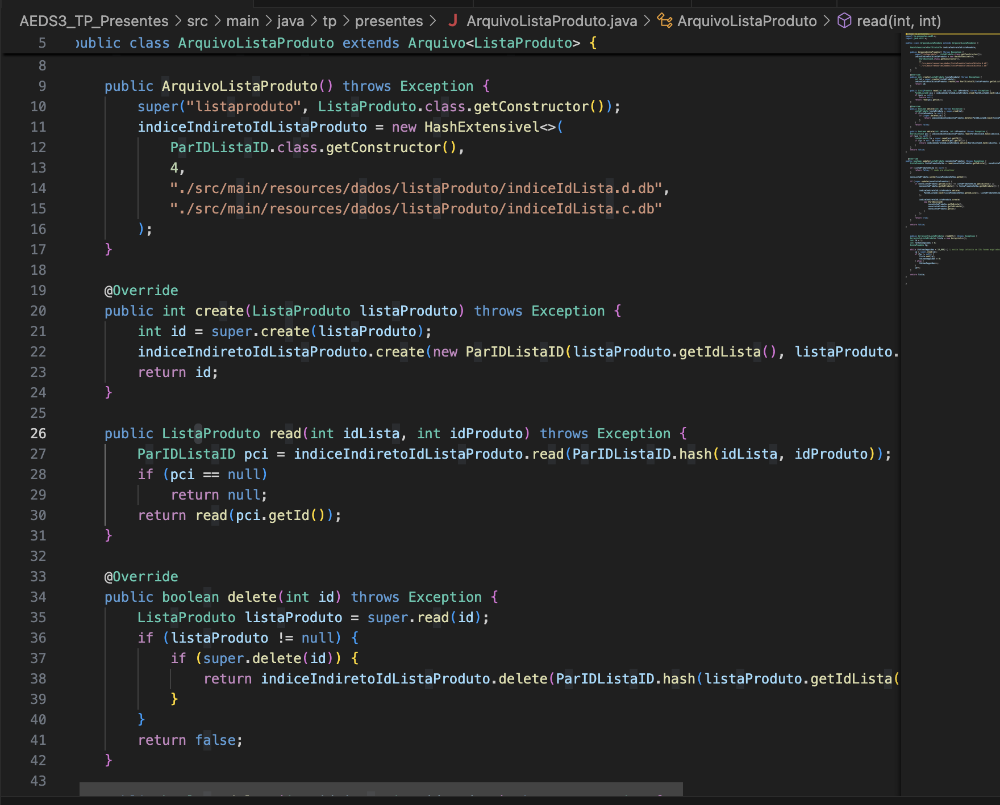
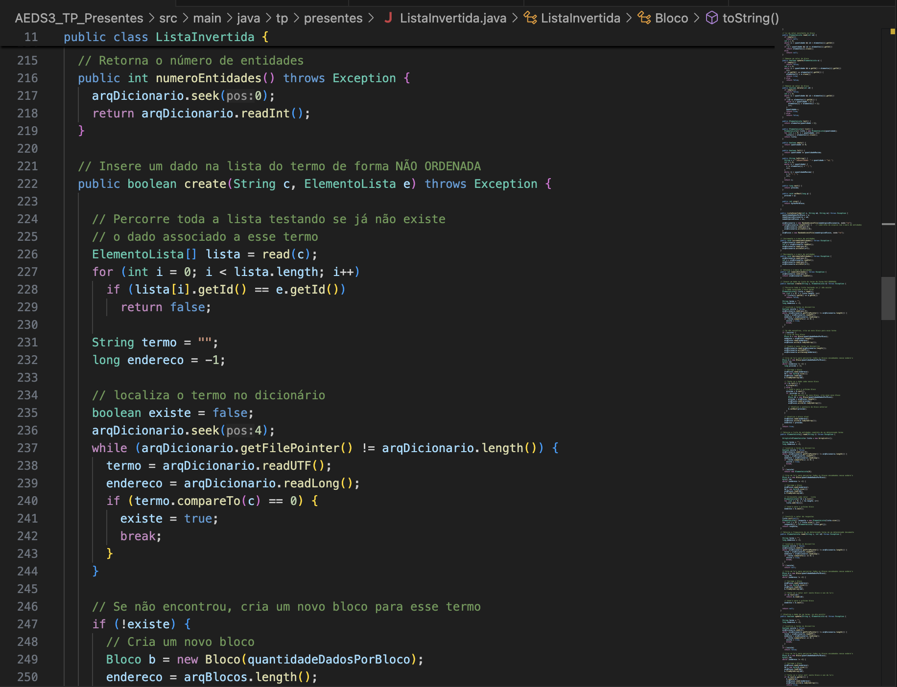
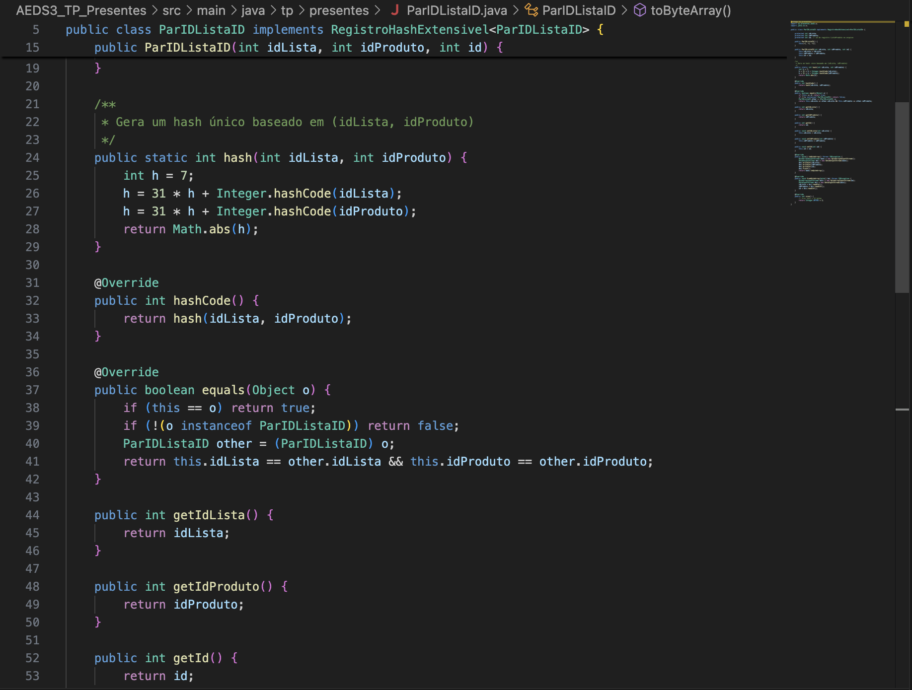

# Relatório do Trabalho Prático

## Participantes
- Davi Manoel
- Felipe Costa
- Felipe Quites
- Nayron Campos

---

## Descrição do Sistema

O sistema é uma aplicação console desenvolvida em Java que permite:
- Cadastro, leitura, atualização e exclusão (CRUD) de usuários.
- Criação, edição e visualização de listas de presentes vinculadas a usuários (cada `Lista` possui um `idUsuario`).
- Cadastro e consulta de produtos (cada `Produto` tem nome, GTIN-13, descrição e flag de ativo/inativo).
- Associação N:N entre listas e produtos através de registros de associação `ListaProduto` que armazenam quantidade e observações por produto em cada lista.
- Busca textual de produtos por palavras (indexação invertida) com ranking por relevância (TF–IDF simplificado), usada tanto no menu de manutenção de produtos quanto ao acrescentar produtos a uma lista.

Arquivos de dados e índices:
- Os dados persistidos estão em `src/main/resources/dados/<entidade>/` (cada entidade tem um subdiretório), e cada repositório usa um arquivo `.db` binário principal e arquivos auxiliares para índices.
- O índice invertido usa o diretório `src/main/resources/dados/listaInvertida` para armazenar dicionário/ blocos do índice.

---

## Capturas de Tela
A seguir estão algumas telas do sistema para facilitar a correção:

---

## Estrutura de Classes
O sistema foi desenvolvido utilizando uma arquitetura orientada a objetos.  
As principais classes são:  

Lista mais completa de classes (com arquivos relevantes):

- `Usuario` — `src/main/java/tp/presentes/Usuario.java` (registro de usuário, serialização).
- `Lista` — `src/main/java/tp/presentes/Lista.java` (registro de lista, código NanoID, datas, vínculo ao usuário).
- `Produto` — `src/main/java/tp/presentes/Produto.java` (registro de produto, ativo/inativo, serialização).
- `ListaProduto` — `src/main/java/tp/presentes/ListaProduto.java` (registro de associação lista↔produto com `quantidade` e `observacoes`).
- `Arquivo` (base) — `src/main/java/tp/presentes/aed3/Arquivo.java` (operações genéricas de CRUD em arquivo com reaproveitamento de espaços deletados).
- `ArquivoUsuario`, `ArquivoLista`, `ArquivoProduto`, `ArquivoListaProduto` — gerenciam persistência e índices indiretos (hashs/árvores) em `src/main/java/tp/presentes/`.
- `HashExtensivel` — `src/main/java/tp/presentes/aed3/HashExtensivel.java` (índice hash extensível para mapas chave→endereço).
- `ArvoreBMais` — `src/main/java/tp/presentes/aed3/ArvoreBMais.java` (estrutura B+ usada para relações 1:N e buscas por chave composta).
- `ListaInvertida` — `src/main/java/tp/presentes/ListaInvertida.java` (implementação do índice invertido, dicionário + blocos de elementos `ElementoLista`).
- `MenuUsuario`, `MenuLista`, `MenuProduto`, `Principal` — classes de interface/fluxo do usuário em `src/main/java/tp/presentes/`.
- `Par...` classes: `ParCPFID`, `ParCodigoID`, `ParIDListaID`, `ParIntInt`, `ParIDEndereco` — chaves/pares usadas nos índices.

---

## Operações Especiais
O sistema contém as seguintes operações especiais:  

1. Tabela Hash Extensível para acesso direto a registros de usuários e listas.
2. Árvore B+ para gerenciamento do relacionamento entre usuários e listas.
3. Índice invertido (classe `ListaInvertida`) — armazena o mapeamento termo → lista de (id, frequência). É usado para pesquisar produtos por palavras no nome. A classe implementa:
  - um arquivo de dicionário (termos) e um arquivo de blocos (listas de referências);
  - operações básicas: `create(term, ElementoLista)`, `read(term)` (retorna array de `ElementoLista`), `update(term, ElementoLista)` e `delete(term, id)`;
  - controle de quantidade de entidades (para cálculo de TF/IDF simples) e inserção não ordenada para performance.
4. Associação normalizada lista↔produto (`ListaProduto`) — em vez de armazenar produtos embutidos na lista, há um arquivo `listaproduto` com registros que guardam `idLista`, `idProduto`, `quantidade` e `observacoes`. Essa normalização facilita atualizações e índices secundários (por exemplo, buscar todos os produtos de uma lista via `ArvoreBMais` ou via `HashExtensivel`).
5. Persistência em arquivos binários com índices auxiliares — cada entidade tem um diretório em `src/main/resources/dados/<entidade>/` e arquivos `.db` para dados e índices secundários (por exemplo, `indiceGtin`, `indiceCodigo`, `indiceIdLista`).

Breve nota técnica sobre erros conhecidos
- "Negative seek offset" em `ArvoreBMais`: geralmente ocorre quando a árvore tenta seek para um offset inválido — possível causa: arquivos de índice ou dados corrompidos (mismatch de versões/tamanhos). Recomenda-se backup e remoção de arquivos `.db` corrompidos para re-criação limpa.
- IDs incorretos (ex.: id 0 ou saltos): investigar o arquivo `.db` de dados e os arquivos de índice; certifique-se de não reutilizar o mesmo arquivo para estruturas com formatos diferentes.

## Como rodar

1. Na raiz do projeto, compile com Maven:

mvn clean compile

2. Para executar a aplicação

mvn exec:java

## Observações

- Para facilitar a correção, os arquivos de dados por entidade ficam em: `src/main/resources/dados/usuarios`, `.../listas`, `.../produtos`, `.../listaproduto`, `.../listaInvertida`.
- Principais pontos a testar manualmente:
  1. Cadastro / login de usuário (`MenuUsuario`).
 2. Criação de lista (`MenuLista` → criar lista) e verificação de vínculo `idUsuario`.
 3. Cadastro de produto (`MenuProduto`), busca por palavra (menu de produtos) e busca ao acrescentar produto a uma lista.
 4. Adicionar o mesmo produto mais de uma vez a uma lista e verificar incremento de `quantidade` no `ListaProduto`.

3. Persistência em disco utilizando arquivos binários para garantir integridade dos dados.
4. Compartilhamento de listas por meio de códigos únicos.

---

## Checklist Obrigatório

Copiem abaixo as perguntas solicitadas pelo enunciado, com respostas sim/não e justificativas:

- O índice invertido com os termos dos nomes dos produtos foi criado usando a classe `ListaInvertida`?

  **Resposta:** Sim. Implementamos a classe `ListaInvertida` (arquivo `src/main/java/tp/presentes/ListaInvertida.java`) que mantém um dicionário de termos e blocos de referências (`ElementoLista`) para cada termo. Os arquivos de dados do índice invertido são esperados em `src/main/resources/dados/listaInvertida`.

- É possível buscar produtos por palavras no menu de manutenção de produtos?

  **Resposta:** Sim. O menu de produtos (`src/main/java/tp/presentes/MenuProduto.java`) contém funcionalidades de busca por termos — métodos como `buscarProdutoPorNome` e o fluxo interativo `listarProdutoPorNome` fazem a busca, normalização (remoção de acentos e stop words) e ordenam resultados por relevância (TF–IDF).

- É possível buscar produtos por palavras na hora de acrescentá-los às listas dos usuários?

  **Resposta:** Sim. Ao acrescentar produtos a uma lista (fluxo em `MenuLista` → `acrescentarProdutos`), o sistema permite buscar por nome/palavras e escolher resultados para adicionar à lista. A integração usa `MenuProduto` para realizar a busca e, em seguida, `ArquivoListaProduto` para criar/atualizar a associação (com quantidade).

- O trabalho compila corretamente?

  **Resposta:** Sim. O projeto compila via Maven (`mvn compile`) depois das correções aplicadas durante o desenvolvimento. Observação: durante a implementação tivemos pequenos ajustes em métodos auxiliares e dependências (por exemplo, correções de `hashCode` e assinaturas), então em máquinas diferentes pode ser necessário limpar/build completo (`mvn clean compile`).

- O trabalho está completo e funcionando sem erros de execução?

  **Resposta:** Não completamente. As funcionalidades de cadastro, edição e busca de produtos estão implementadas e testadas, mas há problemas conhecidos relacionados à persistência de `Lista`/associações em alguns cenários:

  - Em alguns ambientes percebemos que listas não ficam registradas corretamente no arquivo (IDs estranhos, criação com id 0 ou saltos), possivelmente devido a arquivos de dados/índices corrompidos ou ao uso indevido de arquivos de índice como se fossem arquivos de dados. Isso também pode causar erros no acesso à Árvore B+ (por exemplo, "Negative seek offset").
  - A implementação do índice invertido (`ListaInvertida`) e dos fluxos de busca está pronta, mas exige que os arquivos de dados do índice em `src/main/resources/dados/listaInvertida` estejam presentes (criados). Caso os arquivos de metadados/index estejam corrompidos, recomenda-se fazer backup e remover os arquivos `.db` para permitir re-criação limpa.

  Portanto, o sistema compila e a maior parte das funcionalidades funciona, mas há problemas de persistência/consistência de arquivos que precisam de limpeza/reinicialização para garantir execução livre de erros em todas as máquinas.

- O trabalho é original e não a cópia de um trabalho de outro grupo?

  **Resposta:** Sim. O código-fonte foi desenvolvido pelo grupo e contém também implementações fornecidas pelo professor (por exemplo, estruturas da disciplina) — isso foi declarado no relatório.

---

### Dificuldades

- Árvore B+: problemas com offsets em arquivos binários.
- Sincronização de índices: manter índices e dados consistentes.
- Índice invertido: normalizar texto e ordenar resultados.

